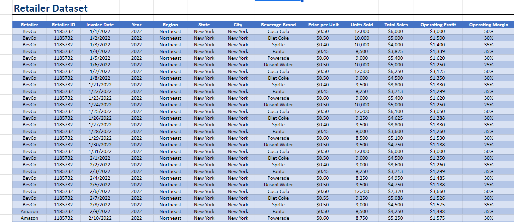
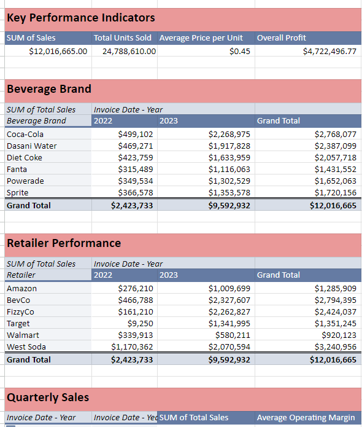
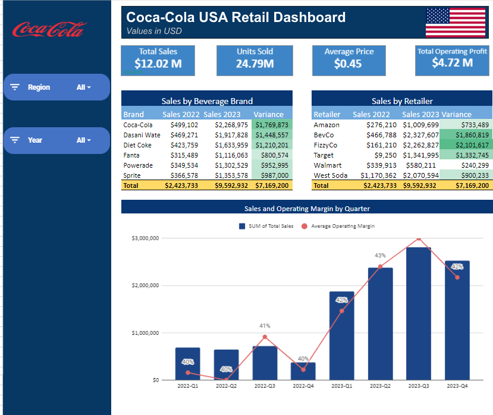

# Retailers Coca-Cola Products Analysis

## Introduction
This project analyzes dummy data on retailers who are into Coca-Cola products in the United States. 

*Please note that the dataset is not real and is solely for practice purposes.*

You can download the Excel file from [this link](Excel file).

The file contains three tabs/sheets:
- **Data**
- **Analysis**
- **Dashboard**

## Problem Statement
The goal of this analysis is to evaluate the performance of different Coca-Cola products from 2022 to 2023. Specifically, we seek to answer the following questions:
1. What is the sales trend for these products over this period?
2. What is the sales trend of our various retailers?
3. Which retailer has made the most sales over the years?

## Data Transformation
The data was clean, but some transformations were necessary for easier analysis:
- I converted the data into a table format to facilitate analysis. 
.
- Additionally, I created a `Year` column from the `Invoice Date` column to use as a slicer in the dashboard.

## Analysis
I created four pivot tables to support the analysis:
1. **Key Performance Indicators (KPIs)** - Holds key metrics for the dashboard.
2. **Beverage Brand Performance** - Analyzes the performance of each brand.
3. **Retailer Performance** - Assesses the sales performance of each retailer.
4. **Quarterly Sales** - Summarizes sales data by quarter.

.

## Dashboard
The dashboard is interactive and features:
- **Scorecards** displaying key metrics.
- **Tables** summarizing data.
- **Combo Charts** (column and line) visualizing trends.
- **Slicers** for filtering data interactively.

.

## Insights
1. Approximately **$12 million** in sales were made across 2022 and 2023.
2. Over **27 million** products have been sold during this period.
3. **Coca-Cola** is the highest-selling brand in both 2022 and 2023.
4. **Fanta** is the least selling brand, suggesting it might not be as popular despite its vibrant color.
5. There has been a steady increase in sales from 2022 to 2023.

## Recommendations
1. **Promote Fanta**: Consider marketing campaigns to boost Fanta’s popularity, as it is currently underperforming compared to other brands.
2. **Focus on Coca-Cola**: Since Coca-Cola is the highest-selling product, it may be beneficial to focus more on its distribution and promotion.
3. **Analyze Retailer Strategies**: Investigate the strategies of top-performing retailers and consider applying them across other retailers to boost sales.
4. **Explore Market Trends**: Continue monitoring sales trends quarterly to identify and capitalize on peak sales periods.
